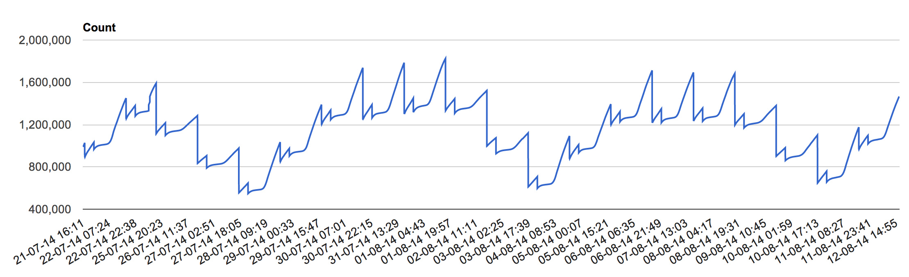

# Mongo Collection Snapshot Analyser
Mongo Collection Snapshot Analyser is a tool that can take snapshots of mongodb collection statistics over a period of time.
It will for example retrive the collection statistics for a configured collection "Tickets" every minute and store it into a seperate mongo collection. 
Over the time there will be data entries for multiple timeframes, which can be graphically displayed in the web ui.

The collections to be analyzed can be configured in ```conf/application.conf```

## Runnign the app
Execute:
``` sbt run ```

In your favorite browser navigate to:
``` http://localhost:9000/ ```

## Technologies
Mongo Collection Snapshot Analyser is implemented using the following technologies (among others):
 * [Scala](http://www.scala-lang.org/)
 * [Play](http://www.playframework.com/)
 * [Akka](http://akka.io/)
 * [MongoDB](http://www.mongodb.com/)
 * [Bootstrap](http://getbootstrap.com/)
 * [Google Charts](https://developers.google.com/chart/)
 * [Coffee Script](http://coffeescript.org/)
 * [Less](http://lesscss.org/)

 ## Screenshots
